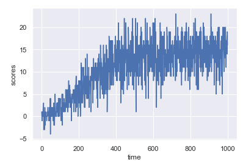

# Report of my trial

## Learning Algorithm
I use the algorithm of reinforcement learning to this task named DQN.
DQN is the Deep Q Network which uses Deep Neural Network model to estimate Q value of Q-learning.
In my case, the deep neural network model consists of below;
 * 1st layer: Fully-Connected layer(input size=37, output size=128, activation=ReLu)
 * 2nd layer: Fully-Connected layer(input size=128, output size=128, activation=ReLu)
 * 3rd layer: Fully-Connected layer(input size=128, output size=4, activation=Linear)
This environment has 37 dimension input data which is like the lazer beam  to be radiated forward of the actor and 4 actions go forward, backward, left and right.

The other hyperparameters of my learning are below;
BUFFER_SIZE = int(1e5)  # replay buffer size
BATCH_SIZE = 64         # minibatch size
GAMMA = 0.99            # discount factor
TAU = 1e-3              # for soft update of target parameters
LR = 5e-4               # learning rate 
UPDATE_EVERY = 4        # how often to update the network

## Plot of Rewards

## ideas for Future Work
To the future, now I used the only the sensor of the forward beam, however in the original DQN papers do with images.
So we can improve the actor with the image as an input.
The other improvement is using more efficient algorithms with pruning.
Now my DQN learns only the basic model to act under the single policy.
To make the learning efficient, we need to use pruning to know what action selection is the best choice in the present for the future.
To do this, we need to apply to prune with Monte-Carlo methods, like Alpha Go.