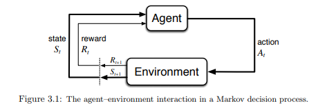
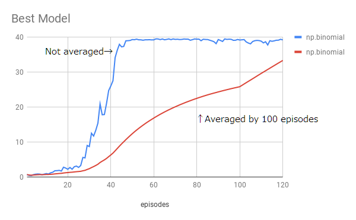
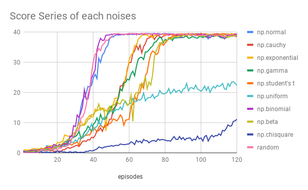
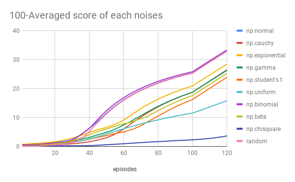

# Report of my trial

## Code sets
 * Continuous_Control_v2.py
 * ddpg_agent.py
 * model.py

## Learning Algorithm
I use the algorithm of reinforcement learning to this task named DDPG.
DDPG is the Deep Deterministic Policy Gradient to apply the continuous action space.
In the DQN it uses argmax in the last layer, so we could not use it in the continuous action space.
In the DDPG it uses two model of Actor and Critic, and Critic evaluates the Actor's action, and the Actor leans from Critic evaluation.
Also, it uses a soft update of weight which blends the old weight parameters and newly calculated parameters.

Here are my tips for implementation below.
 * The instance of every network should be one for each agent.
 * The example of replay memory should be one for each agent.
 * The case of noise generating process should be prepared for each agent.
 * Update model 20 times for each action steps which is a total number of agents and update ten times for each timing.
 * [Important] the choice of random noise distribution type is critical to complete, this is because the opportunity of noise distribution type is equal to how to explore the environment space.
 * I did not use batch normalization.
 * The learning rate recommend changing to 1e-3 but I did not change. 
 * To add random noise with epsilon decayed but I did not use it.

In my case, the network model of DDPG consists of below, same in the Actor and Critic of the Target and Local without the activation function of the output layer;

 * 1st layer: Fully-Connected layer(input size=33, output size=600, activation=ReLu)
 * 2nd layer: Fully-Connected layer(input size=600, output size=450, activation=ReLu)
 * 3rd layer: Fully-Connected layer(input size=450, output size=4, activation=tanh in Actor / Linear in Critic)
This environment has 33 dimension input data for each agent and 4 actions to move the arm.

The other hyperparameters of my learning are below;
BUFFER_SIZE = int(1e5)  # replay buffer size
BATCH_SIZE = 128        # minibatch size
GAMMA = 0.99            # discount factor
TAU = 1e-3              # for soft update of target parameters
LR_ACTOR = 1e-4         # learning rate of the actor
LR_CRITIC = 1e-4        # learning rate of the critic
WEIGHT_DECAY = 0        # L2 weight decay

Also in my trial, I use multiple agent environments.

Additionally, let's talk about steps.
In our environment, each agent takes a step. The step is the one-shot situation which agent act and environment evaluate the reward and send next state.
Here is the diagram of reinforcement learning and one loop is the one step.
  
http://incompleteideas.net/book/bookdraft2017nov5.pdf

Moreover, in my DDPG agent to train 20 agents, the steps are counted based on the act function called. 
This working means that each agent shares the counter of action for training timing.

The Actor and Critic model are made by the deep neural network, which can be optimized by gradient descent method.

## Plot of Rewards

## Discussion
In my trial, I found that the choice of noise distribution function is the most important to converge this task.
I checked the several noise type below;
 * normal distribution
 * cauchy distribution
 * exponential distribution
 * gamma distribution
 * student's t distribution
 * uniform distribution(-1 ~ 1)
 * binominal distribution
 * beta distribution
 * chisquare distribution
These are in numpy library, and parameters are default of numpy. Here is the results.

The normal and binomial distribution reach convergence faster, the uniform and chi-square distribution do not converge, and the others are converged but slower than normal and binomial's.
This result shows that the distribution to add noise is very important to learn the environment to agents, and there is the difference to converge learning with choice of noise distribution.
Also, I assume that the parameter of the noise generator is essential for the same reason.

## Ideas for Future Work
In my trial, I could research the effect of noise choice. So I want to examine more deeply in that field.
For instance;
 * What happens to change noise distribution parameters
 * What happens to the different task.
 * How about the different noise distribution which is effective convergence.averaged on 100 data.