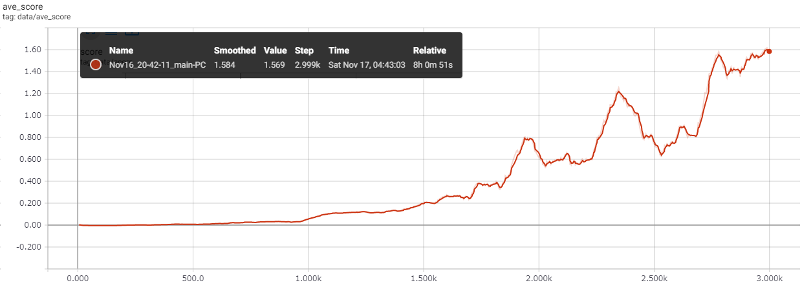

# Report of my trial

## Code sets
 * Tennis.py
 * ddpg_agent.py
 * model.py

## Learning Algorithm
I use the algorithm of reinforcement learning to this task named MADDPG.
MADDPG is the Multi Agent Deep Deterministic Policy Gradient to apply multi agent for the continuous action space.
In the DDPG it uses only one agent of Actor-Critic model.
In the MADDPG it uses multi agents with shared experiment replay, indipendent actor and critic which also have local and target models.
Also, it uses a soft update of weight which blends the old weight parameters and newly calculated parameters by TAU.

Here are my tips for implementation below.
 * The instance of actor_local, actor_target, critic_local and critic_target models should be one for each agent.
 * The instance of experience replay memory should be shared by each agent.
 * The case of noise generating process should not be shared for each agent.
 * Update model one time for each action steps and update one time for each timing.
 * I did not use batch normalization.
 * The learning rate and TAU tuning is important for convergence of training.
 * To add random noise with epsilon decayed but I did not use it.

In my case, the agent network model of the MADDPG consists of below, same in the Actor and Critic of the Target and Local without the activation function of the output layer;

 * 1st layer: Fully-Connected layer(input size=33, output size=600, activation=ReLu)
 * 2nd layer: Fully-Connected layer(input size=600, output size=450, activation=ReLu)
 * 3rd layer: Fully-Connected layer(input size=450, output size=4, activation=tanh in Actor / Linear in Critic)
This environment has 33 dimension input data for each agent and 4 actions to move the arm.

The other hyperparameters of my learning are below;  
BUFFER_SIZE = int(1e6)  # replay buffer size
BATCH_SIZE = 128        # minibatch size
GAMMA = 0.99            # discount factor
TAU = 6e-2              # for soft update of target parameters
LR_ACTOR = 1e-4         # learning rate of the actor
LR_CRITIC = 1e-4        # learning rate of the critic
WEIGHT_DECAY = 0        # L2 weight decay
UPDATE_EVERY = 1        # frequency of the update
N_UPDATES = 1           # number of update for each timing

Additionally, let's talk about steps.
In our environment, each agent takes a step.
The step is the one-shot situation which agent act and environment evaluate the reward and send next state.
Here is the diagram of reinforcement learning and one loop is the one step.  
  
http://incompleteideas.net/book/bookdraft2017nov5.pdf

Moreover, in my case, the step counter is not for each agent, but for all agents.
This means all the agents share the action loop and take different action in the same timing.
The Actor and Critic model are made by the deep neural network, which can be optimized by gradient descent method.

## Plot of Rewards
 * Averaged score with 100 score

 * Original score

## Discussion
In my trial, the selection of TAU and learning rate is very sensitive for converge.
When I try learning rate for 1e-4, the agents get 0.00 score, in the other case when I try TAU=1e-4 also get 0.00 score.
This is because if the update of parameter with very large value, then the agent forget the good behaivior in the past.
So, blending parameter with past model is very important for reinforcement learning.

## Ideas for Future Work
In my trial, I choose learning rate and TAU by manual treatment.
However in the professional use it should be automatically using like grid search or the other method.
